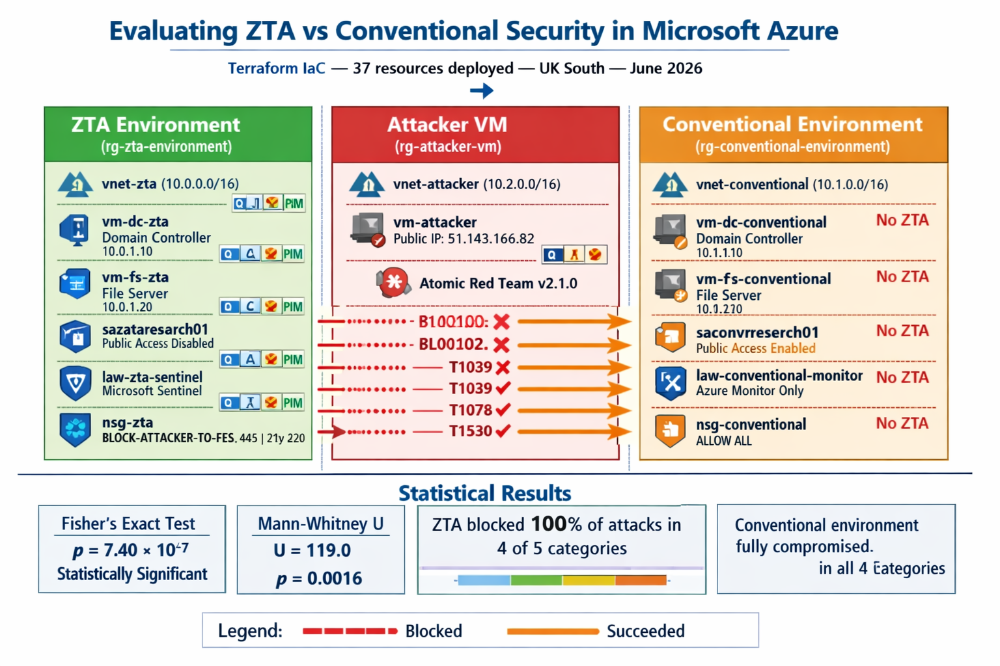

# Zero Trust Architecture vs Conventional Security — Microsoft Azure

[](terraform/)
[](https://azure.microsoft.com)
[](mitre-attack/)
[](data-analysis/)
[](LICENSE)
[](findings/)
[](https://www.shu.ac.uk)

> **MSc Dissertation Research — Sheffield Hallam University**
> Module 55-710260 · Research Methods and Strategies
> **Author:** Arinze Ihekweme · **Supervisor:** Mark Jacobi · **June 2026**

---

## Executive Summary

> *"Empirical evaluation of Zero Trust Architecture (ZTA) vs conventional perimeter security in Microsoft Azure using Terraform IaC, Atomic Red Team MITRE ATT&CK simulations, and Python statistical analysis."*

**The Problem:** Traditional perimeter-based security models grant implicit trust to anything inside a network boundary. As cloud adoption accelerates, this assumption fails — an attacker who gains a foothold inside a VNet has unrestricted lateral movement, unlimited data access, and the ability to exploit cloud storage misconfigurations with a single unauthenticated HTTP request.

**The Research:** Two parallel Azure environments were deployed using Terraform Infrastructure as Code. One implemented a full ZTA control stack (NSG micro-segmentation, Just-In-Time VM access, Defender for Cloud, Conditional Access, PIM, private storage endpoints, Microsoft Sentinel). The other used Azure defaults — no deny rules, no MFA, no monitoring. Both were subjected to 30 MITRE ATT&CK-mapped attack simulations using Atomic Red Team v2.1.0.

**The Key Result:** ZTA blocked 100% of lateral movement, data exfiltration, and privilege escalation attempts. The conventional environment was compromised in every single run. Fisher's exact test confirmed the result was not due to chance: **p = 7.40 × 10⁻⁷ (p < 0.0001)**.

---

## Architecture


*Figure 1: Comparative architecture — ZTA environment (left, green) vs conventional environment (right, orange) connected via VNet peering to the attacker VM (centre). NSG micro-segmentation blocks the attacker from reaching the ZTA file server; the conventional environment has no equivalent protection.*

---

## Key Findings

| MITRE ATT&CK Category | ID | Conventional | ZTA | Result |
|---|---|---|---|---|
| Credential Theft | T1110.001 | NTLM bypass (not blocked) | NTLM bypass (not blocked) | NTLM authenticates directly against on-premises AD — Entra ID CA structurally un-interceptable |
| Lateral Movement | T1021.002 | ✅ Succeeded 3/3 | ❌ Blocked 3/3 | **ZTA effective** |
| Data Exfiltration | T1039 | ✅ Succeeded 3/3 | ❌ Blocked 3/3 | **ZTA effective** |
| Privilege Escalation | T1078 | ✅ Succeeded 3/3 | ❌ Blocked 3/3 | **ZTA effective** |
| Misconfiguration Exploit | T1530 | ✅ Succeeded 3/3 | ❌ Blocked 3/3 | **ZTA effective** |

**Statistical significance:** Fisher's exact test p = 7.40 × 10⁻⁷ · Mann-Whitney U = 119.0, p = 0.0016

→ Full results and charts: [`data-analysis/`](data-analysis/) · Full statistical writeup: [`findings/`](findings/)

---

## Results Showcase

| Chart | What It Shows |
|---|---|
| [`chart1_attack_success_rate.png`](data-analysis/charts/screenshots/chart1_attack_success_rate.png) | Attack success rate — ZTA 0% vs Conventional 100% |
| [`chart3_zta_effectiveness.png`](data-analysis/charts/screenshots/chart3_zta_effectiveness.png) | ZTA effectiveness — 80% categories blocked |
| [`chart4_attack_duration.png`](data-analysis/charts/screenshots/chart4_attack_duration.png) | Duration — ZTA 22s friction vs Conventional <1s |
| [`chart5_statistical_results.png`](data-analysis/charts/screenshots/chart5_statistical_results.png) | p-values on log scale — both tests significant |

→ Full results dashboard: [`results/`](results/)

---

## Repository Structure

```
zta-azure-research/
│
├── 📊 results/                     ← START HERE — Key findings dashboard
│
├── 🏗️  terraform/                  ← Deploy 37 Azure resources with one command
├── ⚙️  infrastructure/              ← Lifecycle management, VM startup, teardown
├── 🔐 zta-security-controls/       ← Apply the full ZTA control stack
│
├── 💻 vms/
│   ├── dc-zta/                     ← ZTA Domain Controller (10.0.1.10)
│   ├── fs-zta/                     ← ZTA File Server (10.0.1.20)
│   ├── dc-conventional/            ← Conventional DC (10.1.1.10)
│   ├── fs-conventional/            ← Conventional FS (10.1.1.20)
│   └── attacker-vm/                ← Attack platform (51.143.166.82)
│
├── 💥 attack-simulation/           ← 30-run MITRE ATT&CK simulation
├── 📈 data-analysis/               ← Python stats, KQL queries, Excel workbook
│
├── 🔬 findings/                    ← Research findings summary
├── ⚔️  comparison/                  ← ZTA vs Conventional deep comparison
├── 🗺️  mitre-attack/               ← Full ATT&CK technique mapping
├── 🔍 sentinel-investigation/      ← SOC analyst incident writeup
└── 🛡️  threat-model/               ← STRIDE threat model
```

Each folder contains:
- `README.md` — what was done, how, why, and challenges faced
- `security.md` — security-specific commands for that session
- `screenshots/` — evidence screenshots for that section only

---

## Prerequisites

Before replicating this experiment you need:

| Requirement | Version / Notes |
|---|---|
| Azure subscription | Contributor access — estimated cost £6–8 for 4-day experiment |
| Microsoft Entra ID P2 | 30-day free trial sufficient for Conditional Access + PIM |
| Terraform | >= 1.5.0 |
| Azure CLI | Latest — `az login` authenticated |
| Python | 3.x with pandas, scipy, matplotlib, openpyxl |
| PowerShell | `Az` module + `Microsoft.Graph` module |
| Git | For cloning and pushing |

---

## Quick Start — Reproduce the Experiment

```bash
# Clone the repository
git clone https://github.com/Arizonal8/zta-azure-research.git
cd zta-azure-research
```

Follow the steps below in order:

**Step 1 — Deploy infrastructure**
```bash
cd terraform
cp terraform.tfvars.example terraform.tfvars
# Edit terraform.tfvars with your subscription_id and admin_password
terraform init && terraform apply
```
→ Detailed guide: [`terraform/README.md`](terraform/README.md)

**Step 2 — Configure domain controllers**
```
Connect to vm-dc-zta and vm-dc-conventional via Azure Bastion
Run setup-commands.txt inside each VM
```
→ [`vms/dc-zta/README.md`](vms/dc-zta/README.md) · [`vms/dc-conventional/README.md`](vms/dc-conventional/README.md)

**Step 3 — Configure file servers**
```
Connect to vm-fs-zta and vm-fs-conventional via Azure Bastion
Run setup-commands.txt to join domain and create SMB shares
```
→ [`vms/fs-zta/README.md`](vms/fs-zta/README.md) · [`vms/fs-conventional/README.md`](vms/fs-conventional/README.md)

**Step 4 — Apply ZTA controls (ZTA environment only)**
```powershell
# From Ubuntu host running pwsh
# Run commands.txt in zta-security-controls/ — applies to rg-zta-environment only
```
→ [`zta-security-controls/README.md`](zta-security-controls/README.md)

**Step 5 — Set up attacker VM**
```
Connect to vm-attacker via RDP on 51.143.166.82
Install Atomic Red Team v2.1.0 and verify connectivity
```
→ [`vms/attacker-vm/README.md`](vms/attacker-vm/README.md)

**Step 6 — Run attack simulations**
```powershell
# From vm-attacker — run attack-commands.txt
# 30 runs: 5 categories × 3 runs × 2 environments
```
→ [`attack-simulation/README.md`](attack-simulation/README.md)

**Step 7 — Analyse results**
```bash
cd data-analysis
python3 analysis.py
# Produces 5 charts + Fisher's exact test + Mann-Whitney U output
```
→ [`data-analysis/README.md`](data-analysis/README.md)

---

## Technology Stack

| Category | Technology | Purpose |
|---|---|---|
| **Cloud** | Microsoft Azure (UK South) | Hosting all research infrastructure |
| **IaC** | Terraform v1.x (AzureRM ~>3.0) | Provision 37 resources reproducibly |
| **Attack** | Atomic Red Team v2.1.0 | MITRE ATT&CK-mapped attack execution |
| **SIEM** | Microsoft Sentinel | Security event collection and analytics |
| **Monitoring** | Azure Monitor Agent v1.22 | Log routing from VMs to workspaces |
| **Identity** | Microsoft Entra ID P2 | Conditional Access + PIM |
| **Statistics** | Python / scipy | Fisher's exact test, Mann-Whitney U |
| **Data** | Python / pandas | CSV processing, data filtering |
| **Charts** | Python / matplotlib | 5 analysis charts at 300 DPI |
| **Scripting** | PowerShell (Az + Graph) | ZTA control activation |
| **Query** | KQL | Sentinel and Azure Monitor telemetry |

---

## Azure Environment Reference

| | ZTA | Conventional | Attacker |
|---|---|---|---|
| Resource Group | `rg-zta-environment` | `rg-conventional-environment` | `rg-attacker-vm` |
| VNet | `10.0.0.0/16` | `10.1.0.0/16` | `10.2.0.0/16` |
| Domain Controller | `vm-dc-zta` · `10.0.1.10` | `vm-dc-conventional` · `10.1.1.10` | — |
| File Server | `vm-fs-zta` · `10.0.1.20` | `vm-fs-conventional` · `10.1.1.20` | — |
| Attacker VM | — | — | `vm-attacker` · `51.143.166.82` |
| Storage | `saztaresearch01` 🔒 private | `saconvresearch01` 🔓 public | — |
| Log Analytics | `law-zta-sentinel` (Sentinel) | `law-conventional-monitor` | — |
| Domain | `ztaresearch.local` | `convresearch.local` | — |
| Total cost | £6.12 across 4 days | (shared) | (shared) |

---

## References

### Primary Sources

| Reference | Contribution |
|---|---|
| [Rose et al. (2020) — NIST SP 800-207: Zero Trust Architecture](https://doi.org/10.6028/NIST.SP.800-207) | Foundational ZTA framework — seven tenets and three implementation approaches |
| [Kindervag (2010) — No More Chewy Centers](https://www.forrester.com) | Original "never trust, always verify" articulation |
| [Sarkar et al. (2022) — Security of Zero Trust Networks](https://doi.org/10.3390/su14181213) | Comparative ZTA evaluation — extends with genuine attack tooling |

### Supporting Sources

| Reference | Role |
|---|---|
| [Dakić, Morić, Kapulica & Regvart (2025) — Analysis of Azure ZTA for Mid-Size Organizations](https://doi.org/10.3390/jcp5010002) | Practitioner ZTA deployment evidence — Azure-specific implementation study |
| [Wang, Z. et al. (2024) — Red Team Automated Testing](https://doi.org/10.1016/j.cose.2024.103945) | Justification for Atomic Red Team selection — ranked top 3 across 80 evaluation criteria |
| [Landauer et al. (2024) — Red Team Redemption: Comparison of Adversary Emulation Tools](https://doi.org/10.1109/TrustCom63139.2024.00043) | Structured comparison of 9 open-source adversary emulation tools |
| [CISA (2021) — Alert AA20-352A: SolarWinds APT Compromise](https://www.cisa.gov/news-events/cybersecurity-advisories/aa20-352a) | Primary source for SolarWinds supply chain attack — perimeter failure case study |
| [SOCRadar (2022) — Microsoft Data Leak and BlueBleed Investigation](https://socradar.io/microsoft-data-leak-and-bluebleed-investigation-65000-entities-111-countries/) | Primary source for BlueBleed Azure Blob Storage misconfiguration incident |
| [MITRE ATT&CK Enterprise Matrix v15.1](https://attack.mitre.org/matrices/enterprise/) | Source of technique IDs used throughout |
| [Red Canary — Invoke-AtomicRedTeam v2.1.0](https://github.com/redcanaryco/invoke-atomicredteam) | Attack execution framework |
| [US Executive Order 14028 (2021)](https://www.federalregister.gov/documents/2021/05/17/2021-10460/improving-the-nations-cybersecurity) | Policy mandate for ZTA adoption |
| [Microsoft Defender for Cloud Docs](https://learn.microsoft.com/en-us/azure/defender-for-cloud/) | Technical reference for Defender Standard tier |
| [Ihekwema (2026) — Azure Cloud Honeypot and SOC Lab](https://github.com/Arizonal8/Azure-Cloud-Honeypot-SOC-Lab-Unauthorised-Access-Monitoring) | Prior empirical observation of external threat scanning frequency on Azure public IPs |

## Ethical Statement

All experimental activities were conducted in a fully isolated Azure subscription containing exclusively synthetic dummy data. No real user data, production systems, or third-party infrastructure was involved. Conducted in compliance with Sheffield Hallam University ethical research guidelines. All resources destroyed on completion (17 June 2026).

---

*Sheffield Hallam University · College of Business, Technology and Engineering · June 2026*
