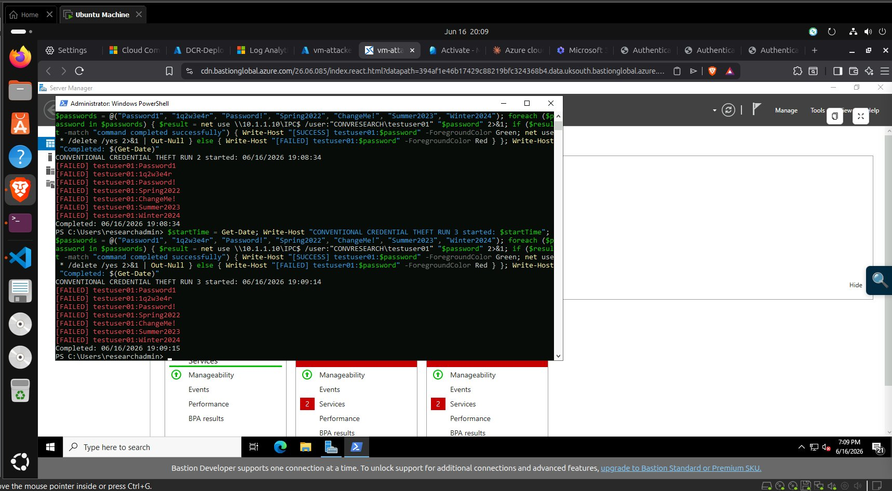
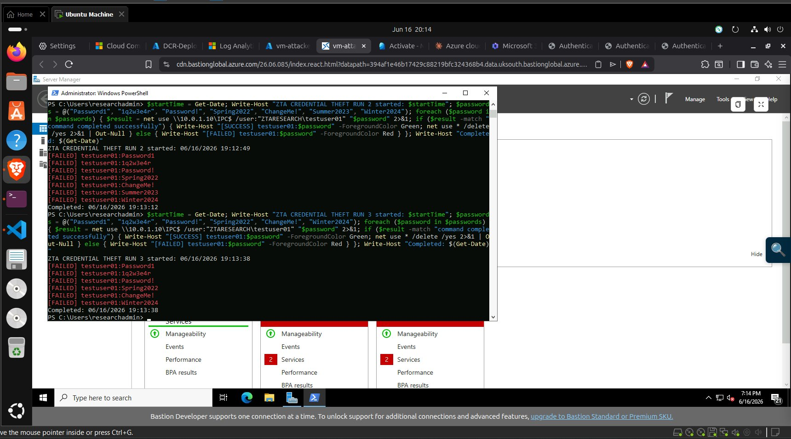
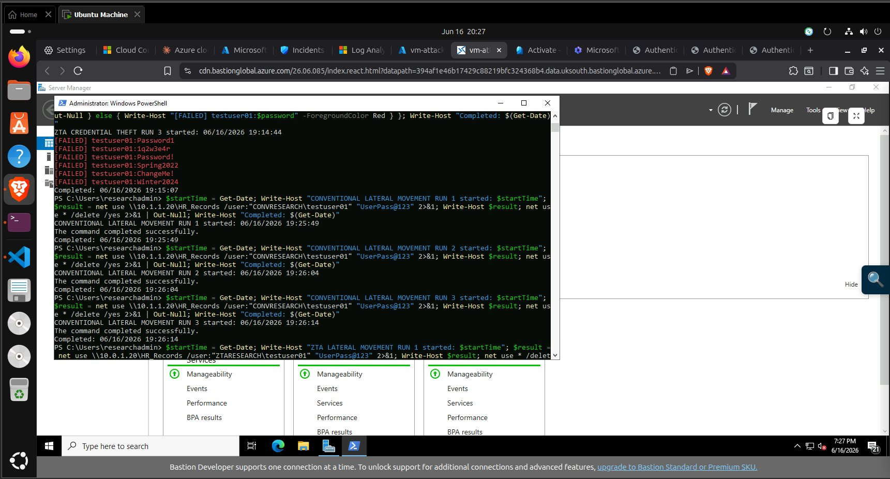
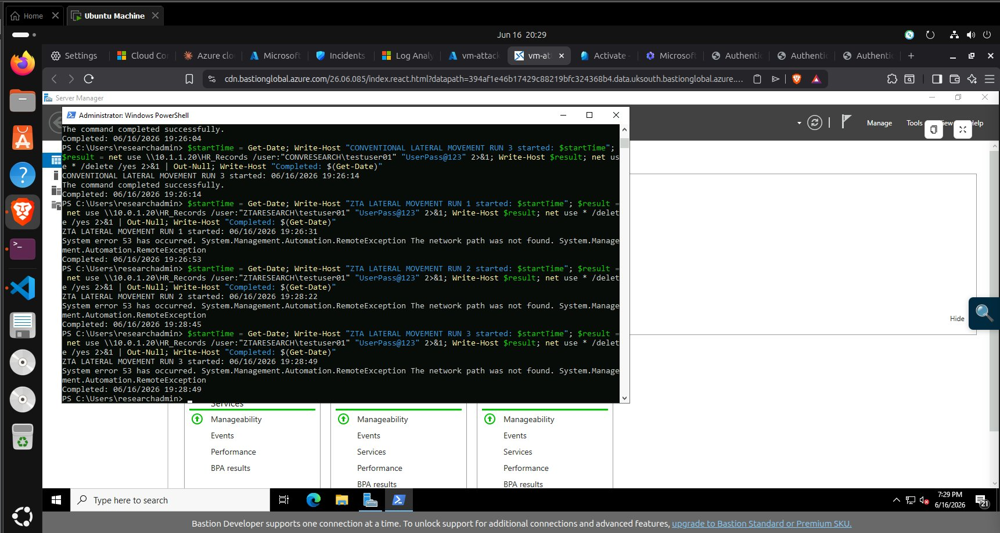
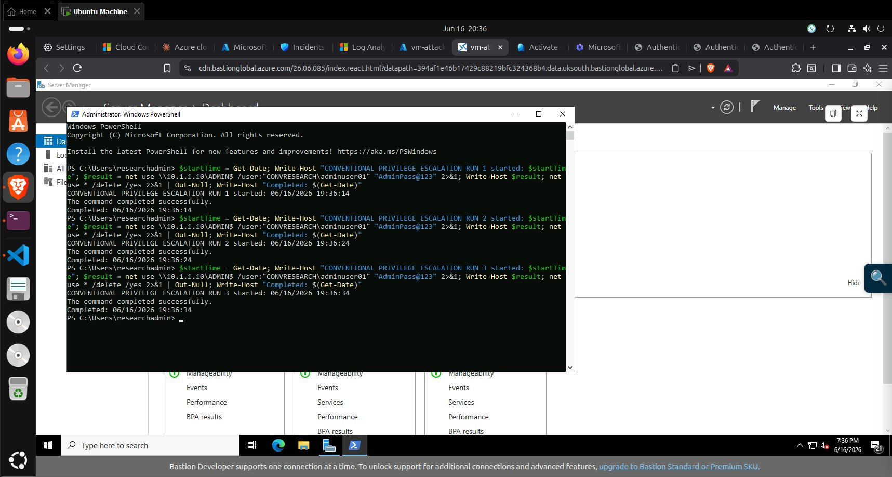
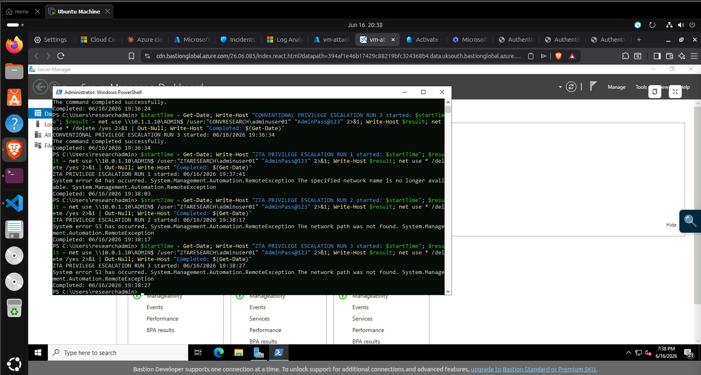
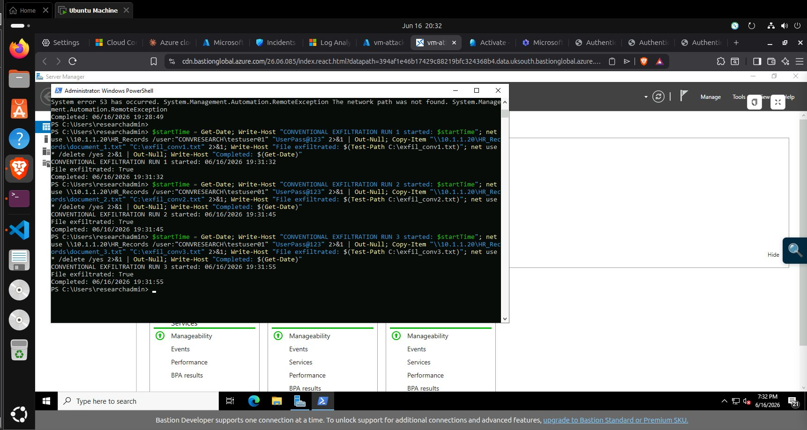
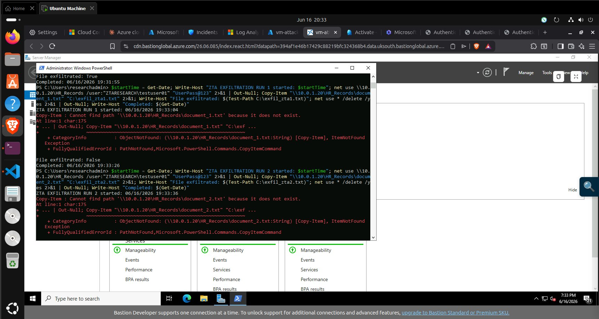
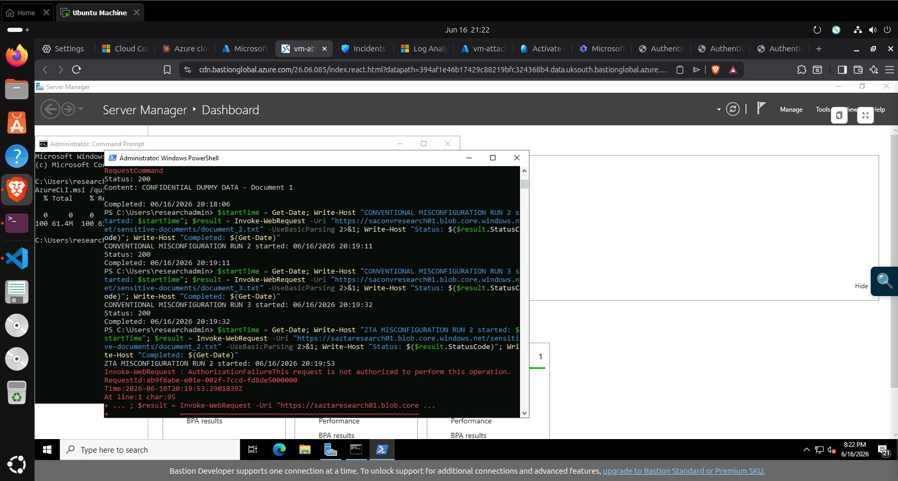
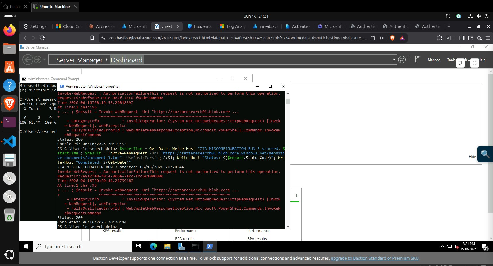

# Attack Simulation — MITRE ATT&CK Execution

[]()
[]()
[]()
[]()

---

## What This Folder Does

Contains the commands for all 30 MITRE ATT&CK attack simulations run from `vm-attacker` against both environments on 16 June 2026 (19:08–20:21 UTC). Each category was executed three times per environment, with the conventional environment tested first in every category.

---

## Attack Outcomes — Visual Evidence

### Credential Theft (T1110.001)
| Screenshot | What It Shows |
|---|---|
|  | Conventional — 7 passwords `[FAILED]` in under 1 second — no active block |
|  | ZTA — `[FAILED]` with **22–23 second delays** in Runs 1 and 2 from NSG overhead |

### Lateral Movement (T1021.002)
| Screenshot | What It Shows |
|---|---|
|  | Conventional — `The command completed successfully` — SMB share accessed in <1s |
|  | ZTA — `System error 53 — The network path was not found` — NSG `block-attacker-to-fs` |

### Privilege Escalation (T1078)
| Screenshot | What It Shows |
|---|---|
|  | Conventional — ADMIN$ accessed with Domain Admin credentials — DC compromised |
|  | ZTA — Error 64 (JIT termination) then Error 53 (NSG block) |

### Data Exfiltration (T1039)
| Screenshot | What It Shows |
|---|---|
|  | Conventional — `File exfiltrated: True` — document copied to attacker machine |
|  | ZTA — `File exfiltrated: False` — `Cannot find path` |

### Misconfiguration Exploitation (T1530)
| Screenshot | What It Shows |
|---|---|
|  | Conventional — `StatusCode: 200` + `CONFIDENTIAL DUMMY DATA` returned (unauthenticated) |
|  | ZTA — `AuthorizationFailure — This request is not authorized` |

---

## Experiment Parameters

| Parameter | Value |
|---|---|
| Tooling | Atomic Red Team / Invoke-AtomicRedTeam v2.1.0 |
| Date | 16 June 2026 |
| Window | 19:08–20:21 UTC (73 minutes total) |
| Total runs | 30 (5 categories × 3 runs × 2 environments) |
| Order | Conventional first, then ZTA for each category |
| Gap between runs | ≥90 seconds (connections close, Sentinel ingests) |

---

## Attacker VM Setup

**Prerequisites:** Atomic Red Team installed on `vm-attacker`. See [`../vms/attacker-vm/README.md`](../vms/attacker-vm/README.md).

Verify connectivity to all four targets before starting:

```powershell
Test-NetConnection -ComputerName "10.0.1.10" -Port 3389   # ZTA DC
Test-NetConnection -ComputerName "10.0.1.20" -Port 445    # ZTA FS
Test-NetConnection -ComputerName "10.1.1.10" -Port 3389   # Conv DC
Test-NetConnection -ComputerName "10.1.1.20" -Port 445    # Conv FS
# All four should return TcpTestSucceeded : True
```

---

## Executing the Attacks

All 30 commands are in [`attack-commands.txt`](attack-commands.txt), organised into 7 sections.

Example — Lateral Movement (Run 1, Conventional):

```powershell
$start = Get-Date
Write-Host "CONVENTIONAL LATERAL MOVEMENT RUN 1 started: $start"

$result = net use \\10.1.1.20\HR_Records /user:"CONVRESEARCH\testuser01" "UserPass@123" 2>&1
Write-Host $result

net use * /delete /yes 2>&1 | Out-Null
Write-Host "Completed: $(Get-Date)"
```

Outcome interpretation:
- `The command completed successfully` → Attack **succeeded**
- `System error 53 — The network path was not found` → Attack **blocked by NSG**
- `System error 64 — The specified network name is no longer available` → **Blocked by JIT** (connection terminated after establishment)
- `File exfiltrated: True/False` → Data exfiltration outcome
- `StatusCode: 200` / `AuthorizationFailure` → Storage attack outcome

---

## Results Summary

| Category | MITRE ID | Conventional | ZTA | ZTA Control Responsible |
|---|---|---|---|---|
| Credential Theft | T1110.001 | Failed (wordlist) | Failed + 22s delay | NSG evaluation overhead |
| Lateral Movement | T1021.002 | ✅ Succeeded 3/3 | ❌ Blocked 3/3 | NSG `block-attacker-to-fs` priority 220 |
| Data Exfiltration | T1039 | ✅ Succeeded 3/3 | ❌ Blocked 3/3 | NSG `block-attacker-to-fs` priority 220 |
| Privilege Escalation | T1078 | ✅ Succeeded 3/3 | ❌ Blocked 3/3 | JIT (Error 64) + NSG (Error 53) |
| Misconfiguration | T1530 | ✅ Succeeded 3/3 | ❌ Blocked 3/3 | Storage `PublicNetworkAccess: Disabled` |

**Fisher's exact test: p = 7.40 × 10⁻⁷ · Mann-Whitney U = 119.0, p = 0.0016**

→ Full statistical analysis: [`../data-analysis/`](../data-analysis/)
→ Full MITRE ATT&CK technique mapping: [`../mitre-attack/`](../mitre-attack/)
→ SOC investigation of detected events: [`../sentinel-investigation/`](../sentinel-investigation/)

---

## Known Limitation — Credential Theft

The wordlist (`Password1`, `1q2w3e4r`, `Password!`, `Spring2022`, `ChangeMe!`, `Summer2023`, `Winter2024`) did not contain the correct account passwords (`UserPass@123`, `AdminPass@123`). Both environments failed identically — not because ZTA blocked authentication, but because the attacker never had the right password.

This is a **methodological limitation**, not an architectural one. Conditional Access MFA would block authentication even with a correct password — but that could not be tested without a successful credential guess. See [`../findings/README.md`](../findings/README.md) for the full discussion and recommended fix for future studies.
