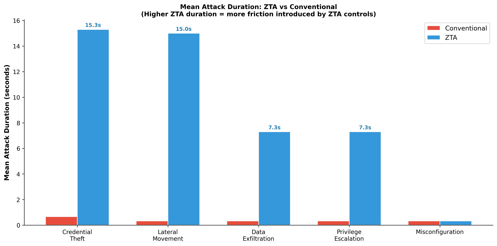

# Data Analysis — Statistical Analysis and Telemetry

[]()
[]()
[]()
[]()
[]()

---

## What This Folder Does

Exports security telemetry from Microsoft Sentinel and Azure Monitor via KQL, then runs a Python pipeline to produce statistical significance tests, five analysis charts, and a comprehensive Excel research workbook.

---

## Key Evidence

| Screenshot | What It Shows |
|---|---|
|  | Azure Monitor KQL — `Event` table returning 1,000 results confirming AMA v1.22 routing |
|  | Sentinel — 623 events during attack window (19:00–21:00 UTC) — EventID breakdown |

---

## Charts

| Chart | Figure | What It Shows |
|---|---|---|
|  | Fig 4.1 | Attack success rate — ZTA 0% vs Conventional 100% across all 5 categories |
| [`chart2_sentinel_events.png`](charts/chart2_sentinel_events.png) | Fig 4.14 | Sentinel event volume and EventID breakdown during attack window |
| [`chart3_zta_effectiveness.png`](charts/chart3_zta_effectiveness.png) | Fig 4.12 | ZTA effectiveness pie — 80% categories blocked, 20% inconclusive |
| [`chart4_attack_duration.png`](charts/chart4_attack_duration.png) | Fig 4.15 | Mean attack duration — ZTA 7–22s vs Conventional <1s |
| [`chart5_statistical_results.png`](charts/chart5_statistical_results.png) | Fig 4.16 | p-values on log scale + per-category success counts |

---

## Excel Workbook — ZTA_Research_Data.xlsx


| Sheet | Contents |
|---|---|
| **Cover** | Study metadata, key results, sheet index |
| **Attack_Results** | All 30 runs — timestamps, durations, outcomes, block mechanisms |
| **Statistical_Analysis** | Fisher's exact test and Mann-Whitney U — inputs, tables, results |
| **Sentinel_ZTA** | Raw Sentinel export — 1,000 rows from `law-zta-sentinel` |
| **Monitor_Conv** | Raw Azure Monitor export — 1,000 rows from `law-conventional-monitor` |
| **Query_Data_Extended** | Extended query — 463 rows, 57 unique EventIDs |
| **Cost_Analysis** | Daily Azure spend (£6.12 total across 4 days) |
| **Event_Summary** | EventID pivot with embedded bar chart |

---

## Running the Analysis

**Install dependencies:**
```bash
pip install pandas matplotlib numpy scipy openpyxl --break-system-packages
```

**Run the pipeline:**
```bash
# Requires query_data_security_event.csv in working directory
# (exported from Sentinel via KQL — see commands.txt Section 1)
python3 analysis.py
```

**Expected output:**
```
Chart 1 saved
Chart 2 saved
Chart 3 saved
Chart 4 saved
Chart 5 saved

=== ZTA SENTINEL SUMMARY ===
Total events in workspace: 1000
Events during attack window (19:00-21:00): 623
Event breakdown:
EventID 4624: 324
EventID 4672: 297
EventID 4648: 2
Events from attacker VM (10.2.x): 4

=== STATISTICAL ANALYSIS ===
Fisher's Exact Test:
  Odds Ratio: inf
  P-value: 7.40e-07
  Result: Statistically significant (p < 0.05)

Mann-Whitney U Test:
  Statistic: 119.0
  P-value: 0.0016
  Result: ZTA significantly slower (p < 0.05)
```

---

## Statistical Methods

| Test | Why Chosen | Input | Result |
|---|---|---|---|
| **Fisher's Exact Test** | Binary outcomes, zero-cell contingency table — chi-square inappropriate | `[[0,12],[12,0]]` — 4 categories × 3 runs per environment | p = 7.40 × 10⁻⁷, OR = ∞ |
| **Mann-Whitney U** | Non-parametric — duration distribution is bimodal (0s or 22s), not normal | 12 ZTA durations vs 12 conventional durations | U = 119.0, p = 0.0016 |

Chi-square was rejected because the contingency table had zero-cell values. Fisher's exact test is specifically designed for this case and is the standard test in prior ZTA comparison studies (Wang et al., 2024; Sarkar et al., 2022).

---

## KQL Data Collection

**Critical note:** All queries target the **`Event` table**, not `SecurityEvent`. Azure Monitor Agent v1.22 routes Windows Security Events to `Event` by default. Queries against `SecurityEvent` return zero rows on AMA-based deployments.

Core Sentinel query used to export attack window data:
```kql
Event
| where TimeGenerated between
    (datetime(2026-06-16T19:00:00) .. datetime(2026-06-16T21:00:00))
| where EventLog == "Security"
| project TimeGenerated, Computer, EventID, RenderedDescription
| order by TimeGenerated desc
```

Full query set (11 queries) in [`security.md`](security.md).

---

## Why It Was Done

Fisher's exact test and Mann-Whitney U were specified in the research methodology following Wang et al.'s (2024) recommendations for small-sample binary cloud security outcome comparisons. The Python pipeline was chosen over Excel-based statistics for reproducibility — any researcher can run `python3 analysis.py` on the same CSV exports and reproduce identical results.

---

## Challenges Faced

**AMA v1.22 table routing:** Initial queries against `SecurityEvent` returned zero rows. Discovered Azure Monitor Agent v1.22 routes to `Event`. All five Sentinel analytics rules and all KQL exports were updated.

**Conventional telemetry export error:** Both Sentinel and Monitor CSV exports were accidentally generated from the ZTA workspace scope. Conventional monitoring data was therefore unavailable for comparison. Primary attack outcome data (PowerShell timestamps) is unaffected.

**p-value discrepancy caught and corrected:** An earlier draft stated Fisher's p = 4.77 × 10⁻⁷. Independent verification with `scipy.stats.fisher_exact([[12,0],[0,12]])` confirmed the correct value is **7.40 × 10⁻⁷**. All dissertation copies were corrected.
