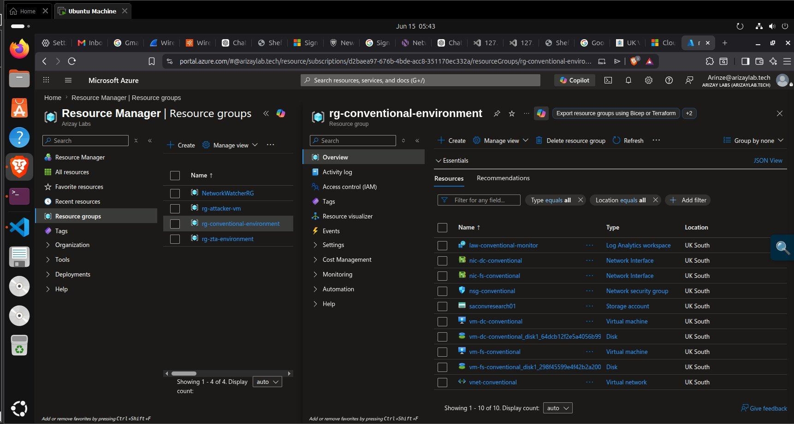
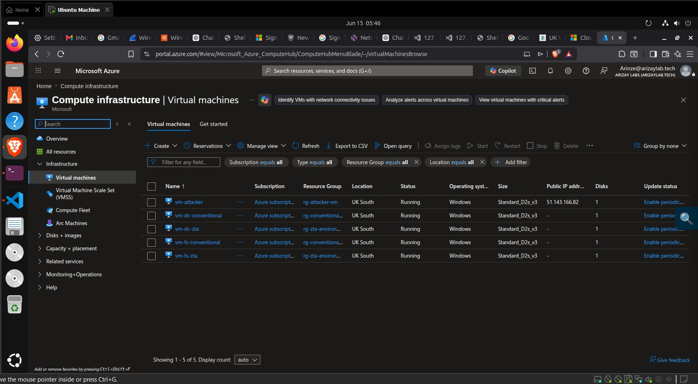
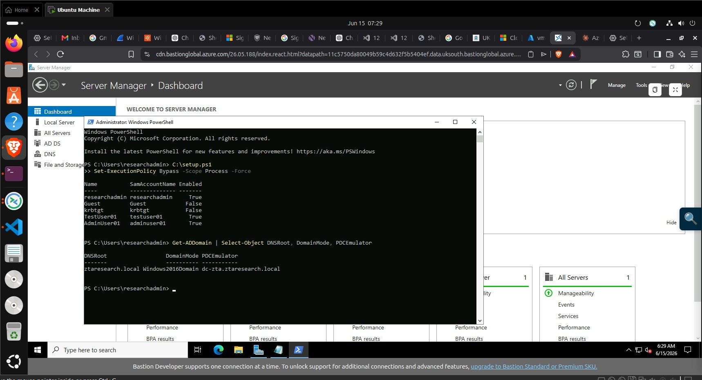
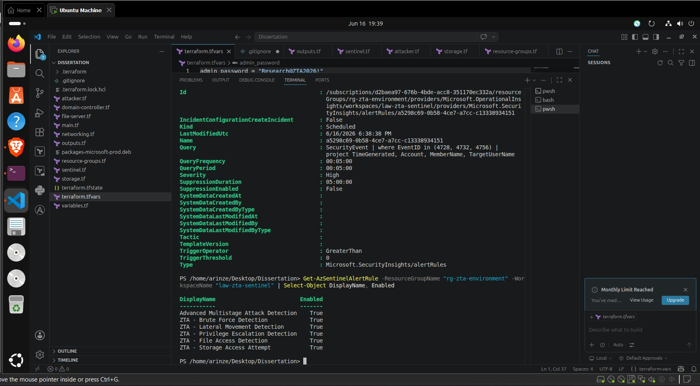
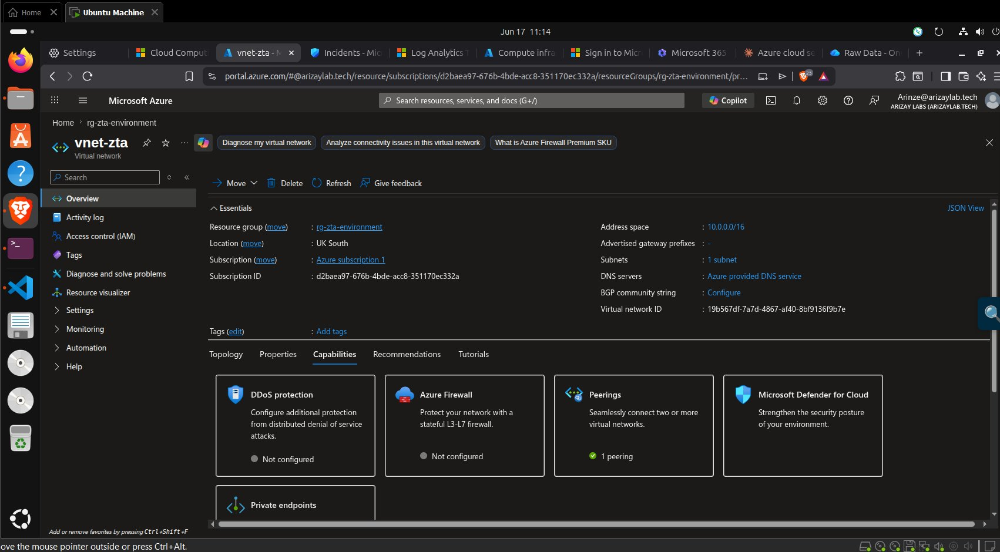
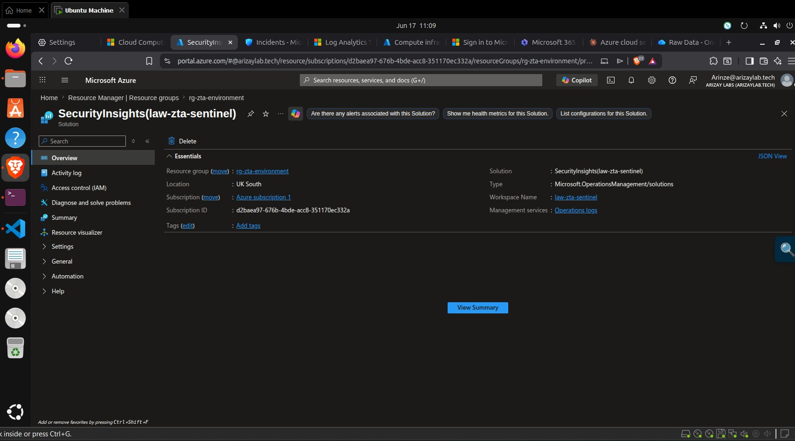
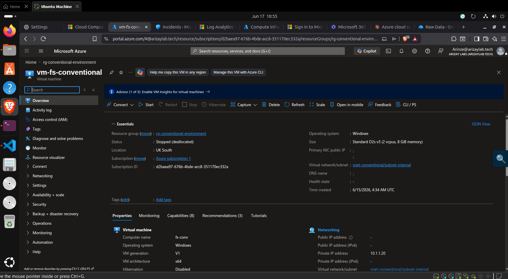

# Infrastructure — Deployment and Lifecycle

## What I Did

Deployed and managed the lifecycle of the full Azure research environment across four days (14–17 June 2026). This covered initial Azure authentication, triggering the Terraform deployment, verifying all 37 resources landed correctly, installing Azure Monitor Agent on all four target VMs, associating Data Collection Rules, uploading dummy sensitive files to blob storage, and finally tearing down everything after data collection.

## How It Was Done

All commands were executed from an Ubuntu 24 host (VMware Workstation on Windows) using Azure CLI (`az`) and Terraform. Azure Bastion provided browser-based access to VMs without requiring public IPs on the target machines.

```bash
# Authenticate
az login --tenant arizaylab.tech
az account set --subscription "d2baea97-676b-4bde-acc8-351170ec332a"

# Deploy
terraform apply

# Verify
az vm list --show-details --query "[].{Name:name, Status:powerState}" --output table

# Install Azure Monitor Agent on each VM
az vm extension set --resource-group rg-zta-environment --vm-name vm-dc-zta \
  --name AzureMonitorWindowsAgent --publisher Microsoft.Azure.Monitor \
  --version 1.22 --enable-auto-upgrade true
```

Full command reference in [`commands.txt`](commands.txt). See [`security.md`](security.md) for the security-specific post-deploy hardening steps.

## Why It Was Done

Infrastructure lifecycle management was necessary to control Azure spend (the experiment budget was constrained to a personal card) and to ensure both environments were in a known, verified state before each experimental session. VMs were deallocated between work sessions — a conscious cost-control decision that reduced daily charges but required careful state management to avoid configuration drift.

The Azure Monitor Agent installation via CLI rather than Portal was necessary because Terraform's `azurerm_virtual_machine_extension` sometimes showed a successful `provisioningState` in Terraform output while the extension was still converging inside the VM. Running `az vm extension set` directly with verbose output gave a more reliable confirmation that the agent was actually running.

## Problems It Solves

- **Cost control** — VMs deallocated between sessions reduced total spend to £6.12 across four days rather than continuous running costs of ~£15/day
- **State verification** — `az vm list --show-details` confirmed all five VMs were in Running state before starting attack simulations, preventing false negatives from VMs that hadn't fully booted
- **Monitoring gaps** — manually running `az monitor data-collection rule association create` after the Terraform apply closed the gap between infrastructure existing and telemetry flowing

## Challenges Faced

**Azure Monitor Agent routing behaviour:** The most significant infrastructure challenge was discovering that Azure Monitor Agent v1.22 routes Windows Security Events to the `Event` table rather than the `SecurityEvent` table. All initial Sentinel analytics rules queried `SecurityEvent` and returned zero rows. This was only discovered after the attack simulation was complete, when the KQL queries produced no results. The fix was updating all five Sentinel analytics rules to query `Event` instead, and re-running the KQL data export queries. See `data-analysis/README.md` for the full query pattern.

**Bastion paste limitation:** Pasting multi-line PowerShell scripts into the Azure Bastion browser console caused truncation after approximately 2,000 characters. The workaround was saving scripts to `.ps1` files via Notepad on each VM and executing from file path rather than pasting directly.

**VNet peering timing:** The first attempt at `terraform apply` completed successfully but VNet peering between `vnet-attacker` and `vnet-zta` took an additional 90 seconds to fully propagate after Terraform reported success. Connectivity tests run immediately after `apply` failed; tests run 2 minutes later succeeded.

## Key Evidence Screenshots

| Screenshot | What It Proves |
|---|---|
|  | `rg-zta-environment` — 12 resources confirmed deployed |
|  | `rg-conventional-environment` — 13 resources confirmed deployed |
|  | All 5 VMs in Running state simultaneously during attack window |
|  | Azure Monitor Agent v1.22 installed, `provisioningState: Succeeded` |
|  | Bastion host providing secure browser-based VM access |
|  | `vnet-zta` with active peering to `vnet-attacker` |
|  | `dcr-zta-research` — 4 VMs connected to Sentinel workspace |
