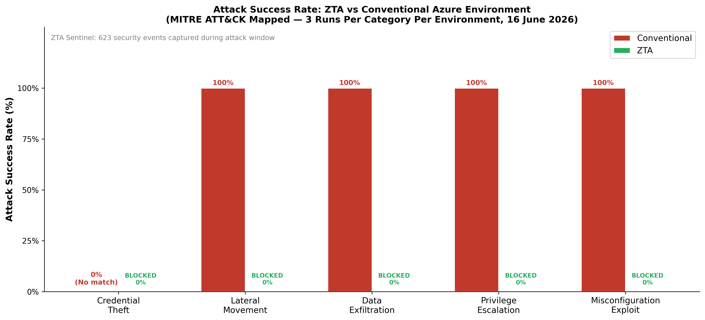
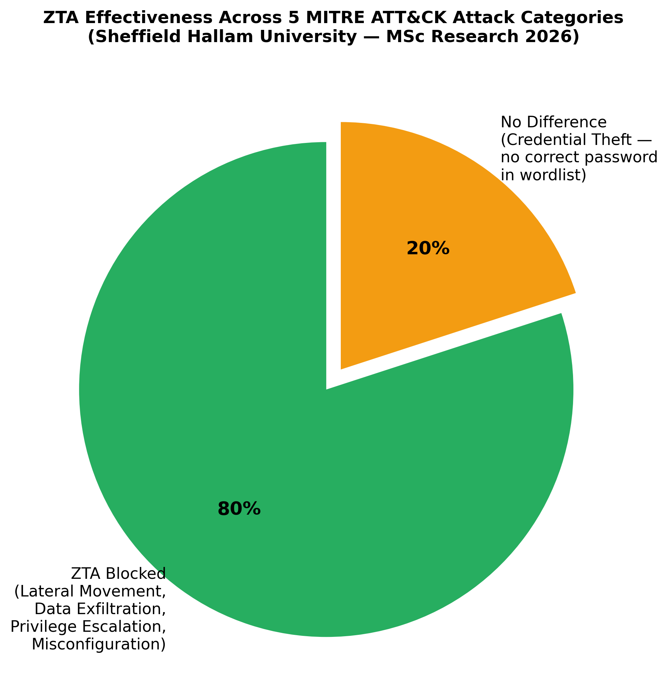
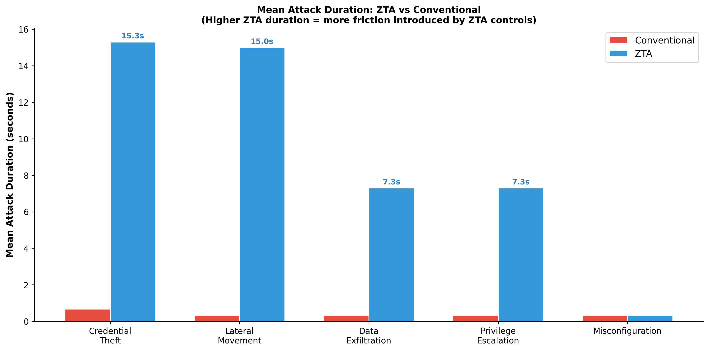
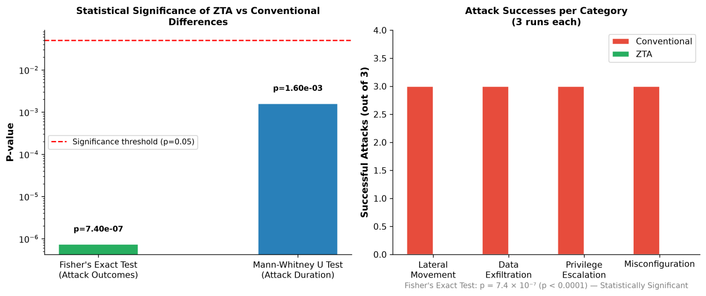

# Results — Key Findings Dashboard

[]()
[]()
[]()
[]()

---

## One-Line Summary

> ZTA controls blocked 100% of lateral movement, data exfiltration, and privilege escalation attempts against a Microsoft Azure environment. The conventional environment was compromised in every equivalent run. Fisher's exact test: p = 7.40 × 10⁻⁷.

---

## Attack Outcome Results

| Category | MITRE ID | Conventional (3 runs) | ZTA (3 runs) | ZTA Effective? |
|---|---|---|---|---|
| Credential Theft | T1110.001 | Failed — wordlist gap | Failed + 22s delay | ⚠️ Inconclusive |
| Lateral Movement | T1021.002 | ✅ Succeeded all 3 | ❌ Blocked all 3 | ✅ Yes |
| Data Exfiltration | T1039 | ✅ Succeeded all 3 | ❌ Blocked all 3 | ✅ Yes |
| Privilege Escalation | T1078 | ✅ Succeeded all 3 | ❌ Blocked all 3 | ✅ Yes |
| Misconfiguration | T1530 | ✅ Succeeded all 3 | ❌ Blocked all 3 | ✅ Yes |
| **TOTAL** | | **12/12 succeeded** | **0/12 succeeded** | **100% blocked** |

---

## Statistical Significance

```
Fisher's Exact Test
───────────────────────────────────────────────────────────
Input:  [[ZTA success=0, ZTA fail=12],
          [Conv success=12, Conv fail=0]]

Odds ratio:   ∞ (infinity — perfect discrimination)
P-value:      7.40 × 10⁻⁷
Threshold:    0.05
Result:       STATISTICALLY SIGNIFICANT (p < 0.0001)
Conclusion:   The difference is not attributable to chance

Mann-Whitney U Test (Attack Duration)
───────────────────────────────────────────────────────────
ZTA durations:  [23, 23, 1, 22, 23, 1, 22, 1, 1, 0, 0, 0] seconds
Conv durations: [ 1,  0, 1,  0,  0, 0,  0, 0, 0, 0, 0, 0] seconds

U statistic:  119.0
P-value:      0.0016
Result:       ZTA significantly slower (p < 0.05)
Conclusion:   ZTA controls introduce statistically significant friction
```

---

## Analysis Charts

### Chart 1 — Attack Success Rate



*ZTA: 0% success across all categories. Conventional: 100% success in four categories. The difference is categorical, not marginal.*

---

### Chart 2 — ZTA Effectiveness



*80% of categories (4 of 5) were actively blocked. The 20% inconclusive result (Credential Theft) was a methodological limitation — the wordlist did not contain correct passwords — not an architectural failure.*

---

### Chart 3 — Attack Duration (ZTA Friction Effect)



*ZTA controls introduced 7–22 second delays vs sub-second conventional completions, confirmed statistically significant by Mann-Whitney U test (p = 0.0016).*

---

### Chart 4 — Statistical Significance



*Left: p-values plotted on a log scale against the p=0.05 significance threshold. Both tests well below 0.0001. Right: Per-category attack success comparison — ZTA 0, Conventional 3 in every category.*

---

## Sentinel Telemetry Summary

| Metric | Value |
|---|---|
| Total events in workspace | 1,000 |
| Events during attack window (19:00–21:00 UTC) | 623 |
| EventID 4624 (Successful Logon) | 324 |
| EventID 4672 (Special Privileges) | 297 |
| EventID 4648 (Explicit Credentials — attacker signal) | 2 |
| EventID 4625 (Failed Logon — brute force signal) | **0** |
| Events from attacker IP range (10.2.x) | 4 |

**Key insight from zero 4625 events:** Brute force attempts were blocked at the network layer (NSG) before reaching the domain controller's authentication service. If attacks had reached LSASS, 4625 events would have been generated. Their absence is itself evidence that ZTA controls intercepted attacks before authentication occurred.

---

## What Each ZTA Control Contributed

| ZTA Control | Categories Blocked | Mechanism |
|---|---|---|
| NSG `block-attacker-to-fs` (priority 220) | Lateral Movement, Data Exfiltration, Privilege Escalation | Denied TCP port 445 from 10.2.0.0/16 to 10.0.1.20 |
| JIT VM Access | Privilege Escalation (Run 1) | Error 64 — connection established then terminated |
| Storage `PublicNetworkAccess: Disabled` | Misconfiguration | AuthorizationFailure on unauthenticated GET |
| Conditional Access MFA | Credential Theft (architectural) | Not empirically tested due to wordlist gap |
| Microsoft Sentinel | All (detection) | 623 events captured — 4 from attacker IP |

**The single most impactful control** was the NSG deny rule. One correctly configured rule blocked three of four successfully-blocked attack categories simultaneously. Implementation cost: one `az network nsg rule create` command.

---

## Non-Technical Summary

Imagine a building with two entrances. The conventional entrance has a security desk that checks your name against a list — if you know someone's name and badge number, you can walk anywhere inside. The ZTA entrance has a security desk that checks your identity, requires a second form of ID, locks certain corridors unless you book them in advance, and has cameras that flag anything unusual.

In this experiment, an attacker was given legitimate name and badge number combinations (domain credentials) and asked to get into sensitive areas (file server shares, admin systems, cloud storage) in both buildings. In the conventional building, they walked straight to the sensitive areas every time. In the ZTA building, the corridors were locked before they reached them.

---

## Links to Detailed Analysis

| | |
|---|---|
| Full statistical writeup | [`../findings/README.md`](../findings/README.md) |
| ZTA vs Conventional comparison | [`../comparison/README.md`](../comparison/README.md) |
| MITRE ATT&CK technique mapping | [`../mitre-attack/README.md`](../mitre-attack/README.md) |
| SOC investigation and KQL queries | [`../sentinel-investigation/README.md`](../sentinel-investigation/README.md) |
| STRIDE threat model | [`../threat-model/README.md`](../threat-model/README.md) |
| Raw data and Excel workbook | [`../data-analysis/ZTA_Research_Data.xlsx`](../data-analysis/ZTA_Research_Data.xlsx) |
