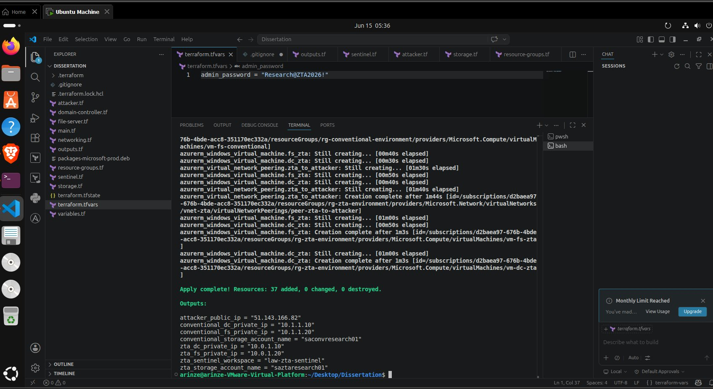
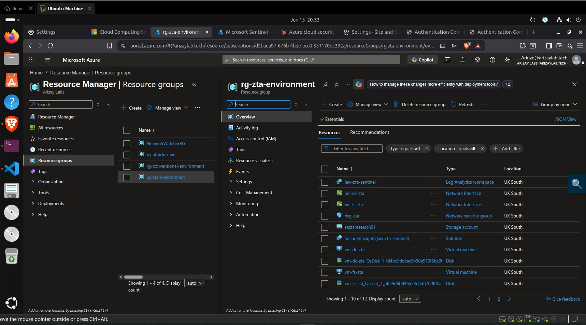
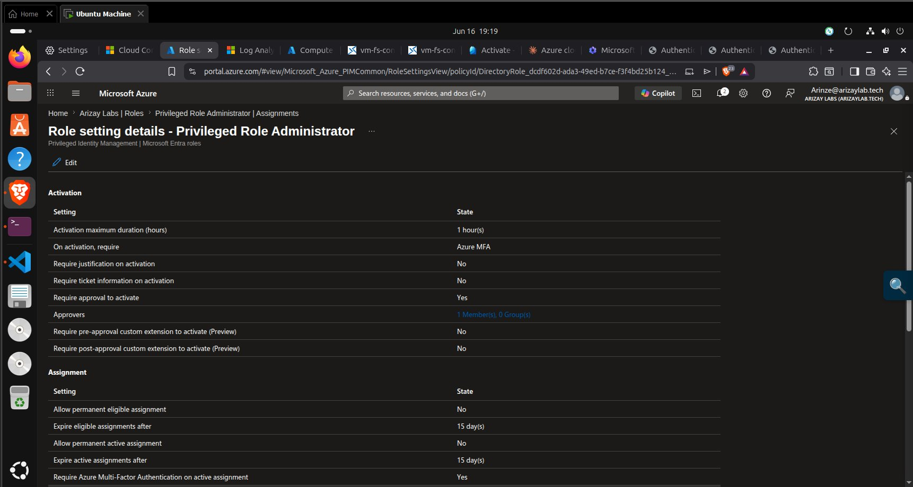

# Terraform — Infrastructure Provisioning

[](https://www.terraform.io)
[](https://registry.terraform.io/providers/hashicorp/azurerm/latest)
[]()
[]()

---

## What This Folder Does

Provisions all 37 Azure resources across three isolated resource groups in a single `terraform apply` (~8 minutes). This includes VNets, subnets, NSGs, virtual machines, storage accounts, Log Analytics workspaces, Sentinel onboarding, Data Collection Rules, and Azure Monitor Agent extensions.

---

## Key Evidence

| Screenshot | What It Proves |
|---|---|
|  | `Apply complete! Resources: 37 added, 0 changed, 0 destroyed` |
|  | All IPs and workspace names confirmed after apply |
|  | `resource-groups.tf` showing three resource group declarations |

---

## Files

| File | Contents |
|---|---|
| `versions.tf` | Provider requirements — `azurerm ~> 3.0` |
| `variables.tf` | Input variables — subscription ID, credentials, VM size |
| `resource-groups.tf` | Three resource groups (`rg-zta-environment`, `rg-conventional-environment`, `rg-attacker-vm`) |
| `networking.tf` | VNets (10.0/10.1/10.2), subnets, VNet peering attacker → both targets |
| `nsg.tf` | NSG rules — ZTA deny rules + conventional permissive baseline |
| `storage.tf` | Two storage accounts — ZTA hardened (`public_network_access_enabled = false`) + conventional open |
| `compute.tf` | Five Windows Server 2022 VMs on `Standard_D2s_v3` |
| `monitoring.tf` | Log Analytics, Sentinel, Data Collection Rules, Azure Monitor Agent |
| `outputs.tf` | Emits all IPs and workspace names after apply |
| `terraform.tfvars.example` | Template for secrets — copy to `terraform.tfvars` |

---

## Prerequisites

```
✅ Azure subscription with Contributor access
✅ Azure CLI authenticated: az login
✅ Terraform >= 1.5.0 installed
✅ terraform.tfvars file created from the example template
```

---

## Key Variables

| Variable | Default | Description |
|---|---|---|
| `location` | `UK South` | Azure region for all resources |
| `subscription_id` | (required) | Your Azure subscription ID |
| `admin_username` | `researchadmin` | Local admin username for all VMs |
| `admin_password` | (required) | Local admin password — set in tfvars, never committed |
| `vm_size` | `Standard_D2s_v3` | VM SKU — 2 vCPUs, 8 GiB RAM |

---

## Deployment Commands

```bash
# 1 — Copy and fill in your secrets
cp terraform.tfvars.example terraform.tfvars
nano terraform.tfvars   # add your subscription_id and admin_password

# 2 — Initialise Terraform
terraform init

# 3 — Preview what will be created (37 resources)
terraform plan

# 4 — Deploy everything
terraform apply

# Confirm with: yes
# Completes in approximately 8 minutes
```

---

## Verify Deployment

After `terraform apply` completes, run these to confirm everything landed:

```bash
# Check all three resource groups exist
az group list --output table

# Confirm all 5 VMs are running
az vm list --show-details \
  --query "[].{Name:name, Status:powerState, RG:resourceGroup}" \
  --output table

# Confirm Sentinel workspace exists
az monitor log-analytics workspace list \
  --resource-group rg-zta-environment \
  --output table
```

Expected output from `terraform output`:
```
attacker_public_ip                = "51.143.166.82"
conventional_dc_private_ip        = "10.1.1.10"
conventional_fs_private_ip        = "10.1.1.20"
zta_dc_private_ip                 = "10.0.1.10"
zta_fs_private_ip                 = "10.0.1.20"
zta_sentinel_workspace            = "law-zta-sentinel"
zta_storage_account_name          = "saztaresearch01"
conventional_storage_account_name = "saconvresearch01"
```

---

## Security Configuration

See [`security.md`](security.md) for the security-specific Terraform configuration — NSG deny rules (HCL), storage hardening, and Sentinel onboarding code embedded in this codebase.

**Critical security rule** (in `nsg.tf`) — responsible for blocking 3 of 4 attack categories:
```hcl
resource "azurerm_network_security_rule" "block_attacker_to_fs" {
  name                       = "block-attacker-to-fs"
  priority                   = 220
  direction                  = "Inbound"
  access                     = "Deny"
  protocol                   = "Tcp"
  destination_port_range     = "445"
  source_address_prefix      = "10.2.0.0/16"
  destination_address_prefix = "10.0.1.20"
  ...
}
```

---

## Why It Was Done This Way

Terraform was chosen over manual Azure Portal provisioning for three reasons. First, **reproducibility** — Wang et al. (2024) specifically recommend IaC as a prerequisite for academically replicable cloud security experiments. Second, **parity** — both environments needed to be identical in every respect except security controls; Terraform's declarative state guarantees this. Third, **transparency** — a codebase is auditable in a way that portal screenshots are not.

---

## Challenges Faced

**Provider version deprecation:** `azurerm_log_analytics_solution` was deprecated in provider ~>3.85. Replaced with `azurerm_sentinel_log_analytics_workspace_onboarding`. 

**Storage lockdown ordering:** `public_network_access_enabled = false` on the ZTA storage account caused blob upload CLI commands to fail immediately after apply. Storage was temporarily re-enabled for uploads then re-locked — documented in `../infrastructure/security.md`.

**VNet peering propagation delay:** Connectivity tests run immediately after `apply` failed. Waiting 2 minutes after apply for peering to propagate resolved this.

---

## Teardown

```bash
# Destroy all 37 resources
terraform destroy

# Verify no resource groups remain
az group list --output table
```
