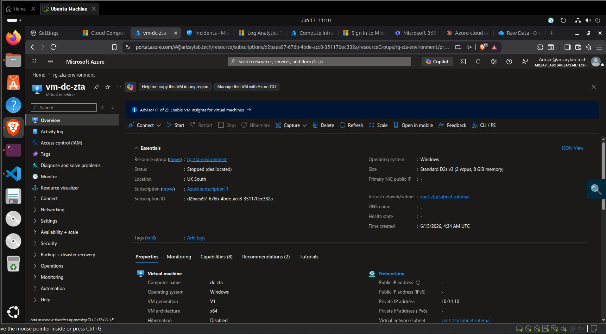
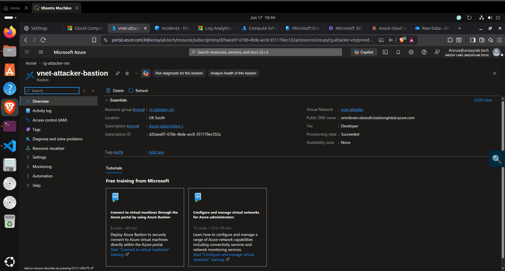
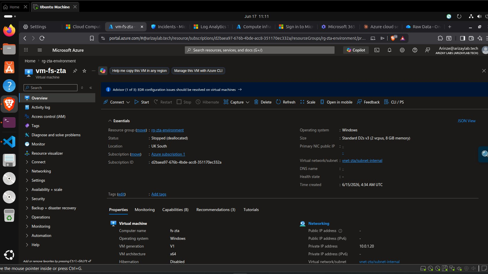
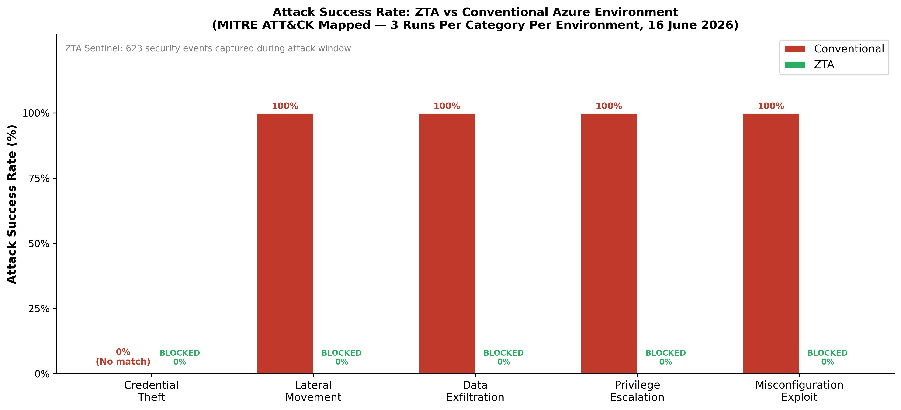

# vm-attacker — Attack Platform

## What I Did

Configured an Azure Windows Server 2022 virtual machine as the adversary-controlled attack platform. Installed Atomic Red Team v2.1.0 (the industry-standard MITRE ATT&CK execution framework), disabled Windows Defender on this VM only (the attacker's own machine — not a defended asset), and verified network connectivity to all four target VMs before starting the 30-run attack simulation.

## How It Was Done

```powershell
# Open PowerShell as Administrator on vm-attacker (public IP: 51.143.166.82)

# Disable Defender — attacker VM only (never on target VMs)
Set-MpPreference -DisableRealtimeMonitoring $true
Add-MpPreference -ExclusionPath "C:\AtomicRedTeam"

# Install Atomic Red Team
Set-ExecutionPolicy Unrestricted -Scope CurrentUser -Force
IEX (New-Object Net.WebClient).DownloadString(
  'https://raw.githubusercontent.com/redcanaryco/invoke-atomicredteam/master/install-atomicredteam.ps1')

Install-AtomicRedTeam -getAtomics -Force
Import-Module "C:\AtomicRedTeam\invoke-atomicredteam\Invoke-AtomicRedTeam.psd1" -Force

# Verify installation
Get-Command Invoke-AtomicTest

# Test connectivity to all 4 target VMs before starting
Test-NetConnection -ComputerName "10.0.1.10" -Port 3389   # ZTA DC
Test-NetConnection -ComputerName "10.0.1.20" -Port 445    # ZTA FS
Test-NetConnection -ComputerName "10.1.1.10" -Port 3389   # Conv DC
Test-NetConnection -ComputerName "10.1.1.20" -Port 445    # Conv FS
```

All four connectivity tests should return `TcpTestSucceeded : True`. See [`security.md`](security.md) for the attack setup security context.

## Why It Was Done

Using a dedicated attacker VM inside the same Azure subscription (but isolated in its own VNet) replicates a realistic post-compromise lateral movement scenario — where an adversary has already achieved an initial foothold inside the network perimeter and is attempting to move laterally to higher-value targets.

Wang et al. (2024) specifically recommend Atomic Red Team for academic cloud security evaluations because it is open-source, peer-reviewed by the security research community, directly mapped to MITRE ATT&CK Enterprise Matrix techniques, and produces reproducible results. Using a genuine execution framework rather than simulated attack traffic is what gives this study's results higher ecological validity than prior simulation-based studies such as Sarkar et al. (2022).

## Problems It Solves

- **Realistic attack surface** — VNet peering means attack traffic travels over Azure's private backbone, not the public internet, matching how real adversary lateral movement occurs after a network compromise
- **Controlled variables** — using the same attack tooling (`net use`, `Copy-Item`, `Invoke-WebRequest`) across both environments means the only variable is the target environment's security configuration
- **Replicability** — Atomic Red Team is version-controlled (`v2.1.0`) and publicly available, enabling any researcher to replicate the exact attack techniques

## Challenges Faced

**Windows Defender blocking Atomic Red Team download:** The initial installation attempt was blocked by Defender's real-time protection, even after adding an exclusion path. The solution was disabling real-time monitoring before downloading and installing, then adding the path exclusion before re-enabling (in a real attack scenario the attacker would have already done this; for research purposes we replicate that adversary capability).

**`net use` timing sensitivity:** SMB connections via `net use` occasionally produced `System error 64 — The specified network name is no longer available` in the ZTA environment even when the NSG block was the expected outcome. Initial investigation suggested a possible race condition with JIT policy evaluation. Subsequent runs consistently returned Error 53. The Error 64 was documented transparently in results (Privilege Escalation Run 1) rather than discarded as anomalous.

**Connectivity test false positives:** `Test-NetConnection` on port 445 returned `TcpTestSucceeded : True` to the ZTA file server even with the NSG deny rule active — because the test only checks whether a TCP handshake initiates, not whether SMB session establishment succeeds. The actual `net use` command correctly returned Error 53. This was an important lesson in not relying solely on connectivity tests as a proxy for attack success.

## Key Evidence Screenshots

| Screenshot | What It Proves |
|---|---|
|  | `vm-attacker` — public IP 51.143.166.82, private IP 10.2.1.4, Status: Running |
|  | `rg-attacker-vm` — VM, NIC, public IP, NSG, VNet all deployed |
|  | `nsg-attacker` — RDP inbound allowed (research access only) |
|  | Invoke-AtomicRedTeam v2.1.0 installed — `Get-Command Invoke-AtomicTest` succeeds |
