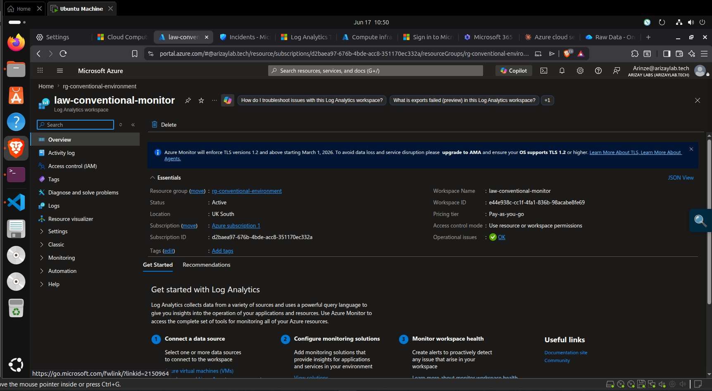
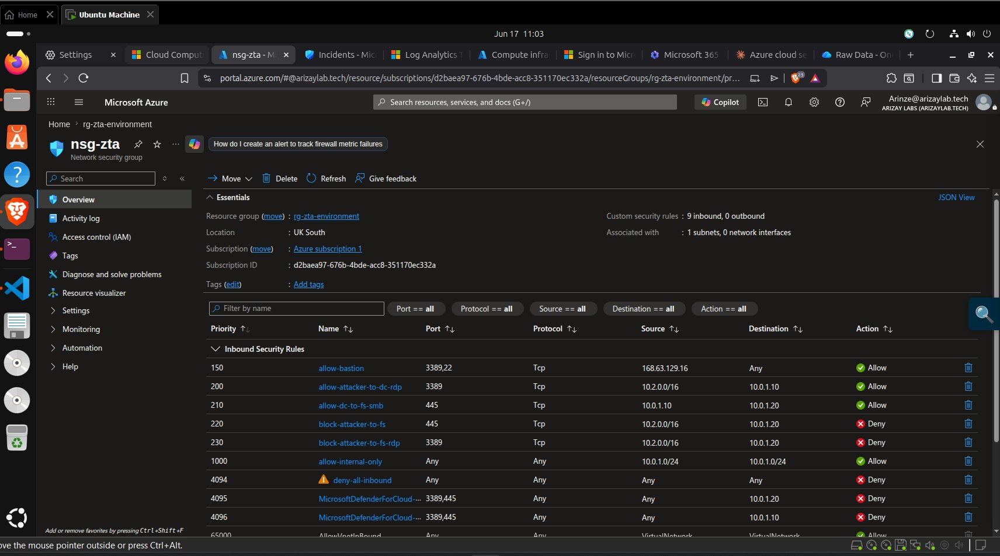

# vm-dc-conventional — Conventional Domain Controller

**IP:** `10.1.1.10` · **Domain:** `convresearch.local` · **Resource Group:** `rg-conventional-environment`

## What I Did

Promoted this VM to root domain controller for `convresearch.local` — the conventional environment's Active Directory domain. Created identical test accounts to the ZTA domain. Applied **no ZTA controls**.

## How It Was Done

Identical process to `../dc-zta/` with `CONVRESEARCH` / `convresearch.local` substituted. See [`security.md`](security.md). No commands from `../../zta-security-controls/` were run against this machine or its resource group at any point.

## Why It Was Done

Infrastructure parity is the cornerstone of the experimental design. If this domain controller differed from `vm-dc-zta` in any meaningful way — VM size, OS version, AD configuration, account setup — then differences in attack outcome could be attributed to those differences rather than to the presence or absence of ZTA controls. Making this VM a precise mirror of `vm-dc-zta` (except for ZTA controls) is what makes the Fisher's exact test result a defensible causal claim.

## Problems It Solves

The conventional environment provides the counterfactual — what happens to the same attacks without ZTA controls. Without it, the study could only show that ZTA blocked attacks, not that blocking was *because* of ZTA rather than some other factor.

## Challenges Faced

**None specific to this VM** — the domain promotion process was identical to `dc-zta`. The main risk was accidentally applying a ZTA control (e.g., running `Set-AzSecurityPricing` without specifying the resource group), which was mitigated by explicitly setting the `ResourceGroupName` parameter on all Azure PowerShell commands.

## Key Evidence Screenshots

| Screenshot | What It Proves |
|---|---|
|  | `vm-dc-conventional` — IP 10.1.1.10, Running, Standard_D2s_v3 |
|  | `convresearch.local` — identical `testuser01` and `adminuser01` accounts |
