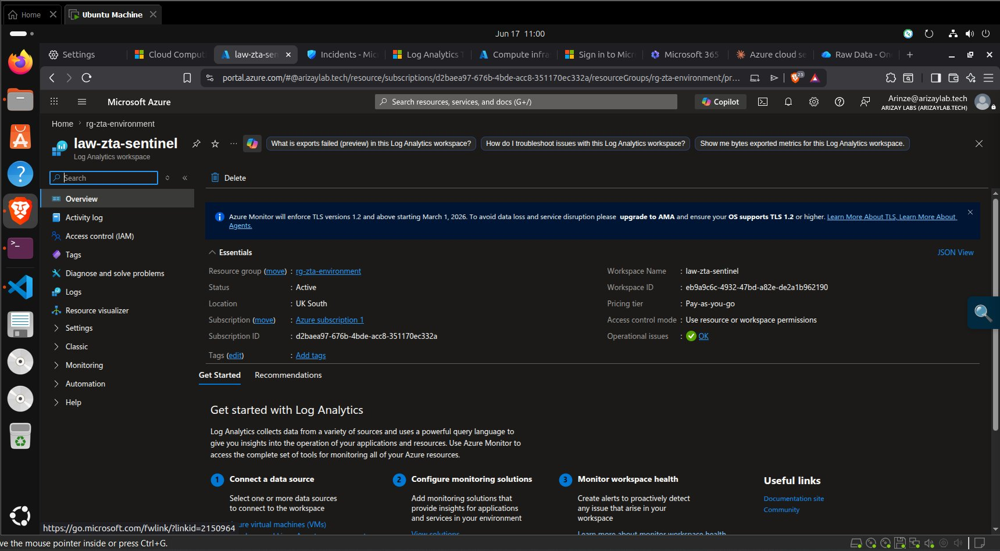
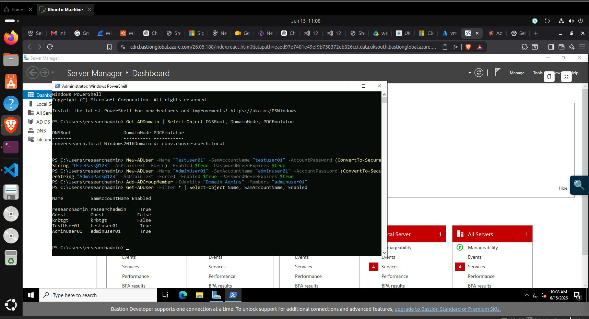

# vm-dc-zta — ZTA Domain Controller

**IP:** `10.0.1.10` · **Domain:** `ztaresearch.local` · **Resource Group:** `rg-zta-environment`

## What I Did

Promoted a fresh Windows Server 2022 VM to become the root domain controller for the ZTA research forest (`ztaresearch.local`). Created two test domain accounts used across the attack simulation: `testuser01` (standard domain user) and `adminuser01` (Domain Administrator).

## How It Was Done

Connected via Azure Bastion. Ran a two-stage PowerShell process: role installation followed by `Install-ADDSForest` which triggered an automatic reboot. After reconnecting post-reboot, created the test accounts and verified via `Get-ADUser`. See [`security.md`](security.md) for full commands.

## Why It Was Done

Active Directory was required to create the realistic enterprise authentication environment that the lateral movement (T1021.002) and privilege escalation (T1078) attacks target. Domain-joined file servers with SMB shares protected by domain credentials are the most common attack surface in enterprise breach scenarios.

The domain is completely isolated from any real AD — it exists only in the `10.0.0.0/16` VNet peered to the attacker VNet, with no connection to the public internet or any real corporate directory.

## Problems It Solves

- **Realistic target** — `net use` with domain credentials (`ZTARESEARCH\testuser01`) is a real-world authentication mechanism, not a simulated one
- **Comparable environments** — mirroring identical accounts in `convresearch.local` means credential differences cannot explain the different attack outcomes

## Challenges Faced

**Reboot timing via Bastion:** `Install-ADDSForest` triggers an immediate VM reboot. The Azure Bastion session disconnects during the reboot and must be re-established. The first reconnection attempt (approximately 2 minutes after running the command) usually fails; waiting 3–4 minutes before reconnecting was reliable.

## Key Evidence Screenshots

| Screenshot | What It Proves |
|---|---|
|  | `vm-dc-zta` — IP 10.0.1.10, Running, Standard_D2s_v3 |
|  | `ztaresearch.local` domain with `testuser01` and `adminuser01` confirmed |
