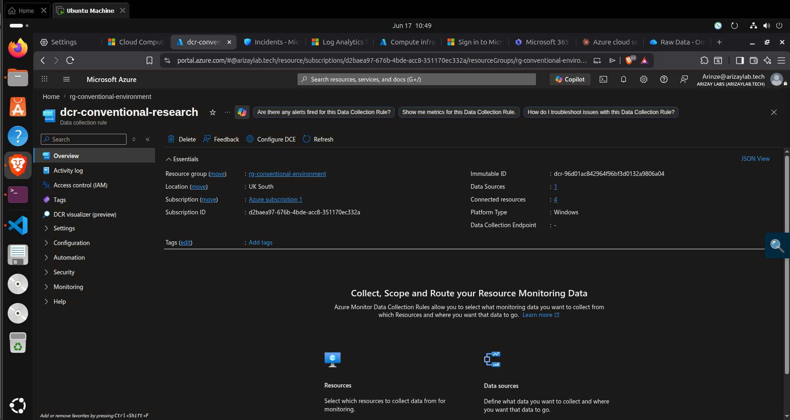

# vm-fs-conventional — Conventional File Server

**IP:** `10.1.1.20` · **Domain:** `convresearch.local` (joined) · **Resource Group:** `rg-conventional-environment`

## What I Did

Configured the conventional file server with an identical SMB share structure to `../fs-zta/`. Applied **no ZTA controls** — the NSG attached to this VM allows all inbound traffic from the attacker subnet.

## How It Was Done

Identical to `../fs-zta/` with `CONVRESEARCH` / `convresearch.local` and DNS `10.1.1.10` substituted. See [`security.md`](security.md).

## Why It Was Done

This VM is the most direct evidence of what conventional perimeter security *cannot* prevent once an attacker has network access. With the attacker VM peered into the `10.1.0.0/16` VNet and `nsg-conventional` containing only permissive allow rules, the attacker had unrestricted network access to this file server — and the attack results reflect this: Lateral Movement and Data Exfiltration succeeded in all three runs.

## Problems It Solves (as the baseline)

Documenting what this VM *doesn't* have — deny rules, JIT access, Defender telemetry — is as important as documenting what the ZTA environment does have. The absence of these controls is the experimental condition.

## Challenges Faced

**None specific.** The main operational discipline required was never running any ZTA commands against this resource group — a discipline that was maintained throughout.

## Key Evidence Screenshot

| Screenshot | What It Proves |
|---|---|
|  | `vm-fs-conventional` — IP 10.1.1.20, Running, domain-joined to `convresearch.local` |
