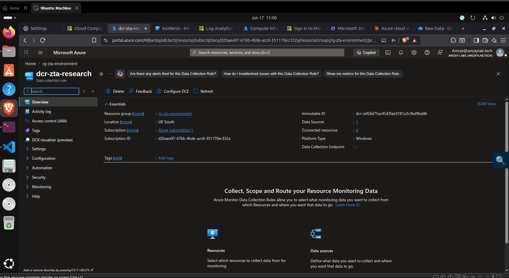

# vm-fs-zta — ZTA File Server

**IP:** `10.0.1.20` · **Domain:** `ztaresearch.local` (joined) · **Resource Group:** `rg-zta-environment`

## What I Did

Joined this VM to the `ztaresearch.local` domain and configured three SMB shared folders containing synthetic sensitive data, mirroring the conventional file server configuration exactly. This VM is the primary target of the Lateral Movement (T1021.002) and Data Exfiltration (T1039) attacks.

## How It Was Done

Connected via Azure Bastion. Pointed DNS to the domain controller (`10.0.1.10`), domain-joined, then created `HR_Records`, `Finance_Reports`, and `Project_Confidential` shares each containing five dummy text files. See [`security.md`](security.md) for full commands.

## Why It Was Done

A realistic SMB file server with domain-joined share permissions is the most common lateral movement target in enterprise breach scenarios. Having the same share structure in both environments ensures that the attack tool (`net use` + `Copy-Item`) behaves identically against both — any difference in outcome is attributable to the surrounding security controls, not the target configuration.

## Problems It Solves

The NSG deny rules (`block-attacker-to-fs`, priority 220) make this VM the key evidence node for ZTA's network-layer micro-segmentation effectiveness. Error 53 (`The network path was not found`) on this specific VM proves the NSG is working.

## Challenges Faced

**DNS pointing before domain join:** Setting the DNS server address to `10.0.1.10` before the domain controller had fully converged (especially if done within 2–3 minutes of the DC reboot) caused `Add-Computer` to fail with "The server cannot find the requested domain". Waiting 5 minutes after the DC reboot before attempting domain join resolved this reliably.

## Key Evidence Screenshot

| Screenshot | What It Proves |
|---|---|
|  | `vm-fs-zta` — IP 10.0.1.20, Running, domain-joined to `ztaresearch.local` |
