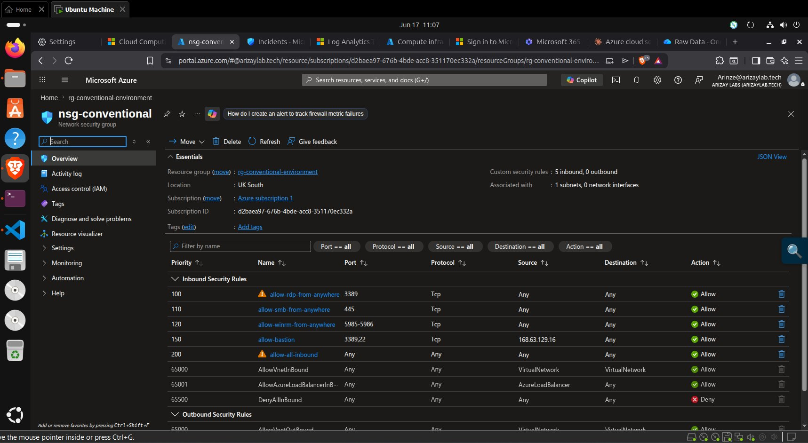
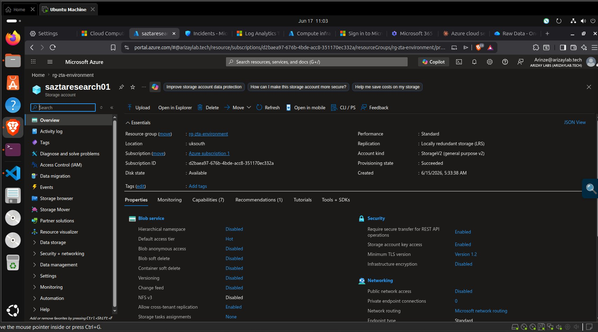
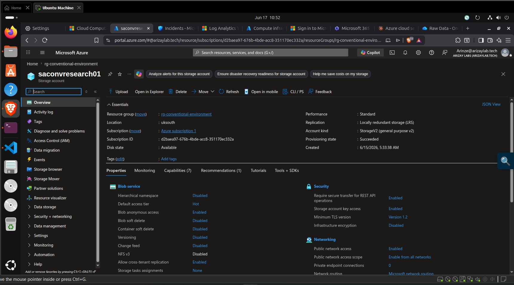
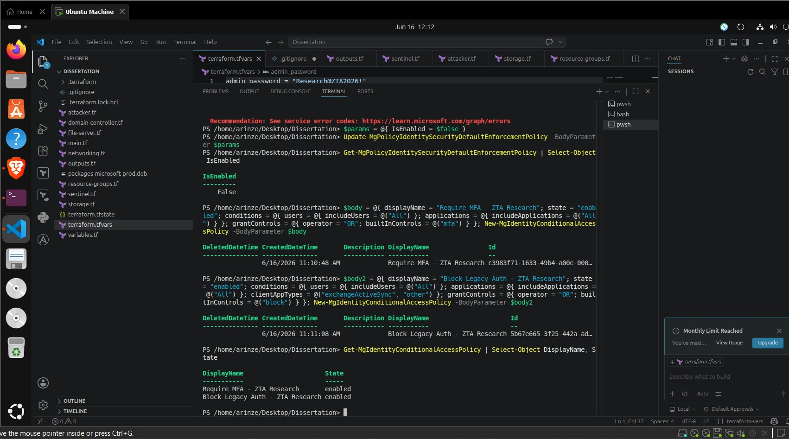
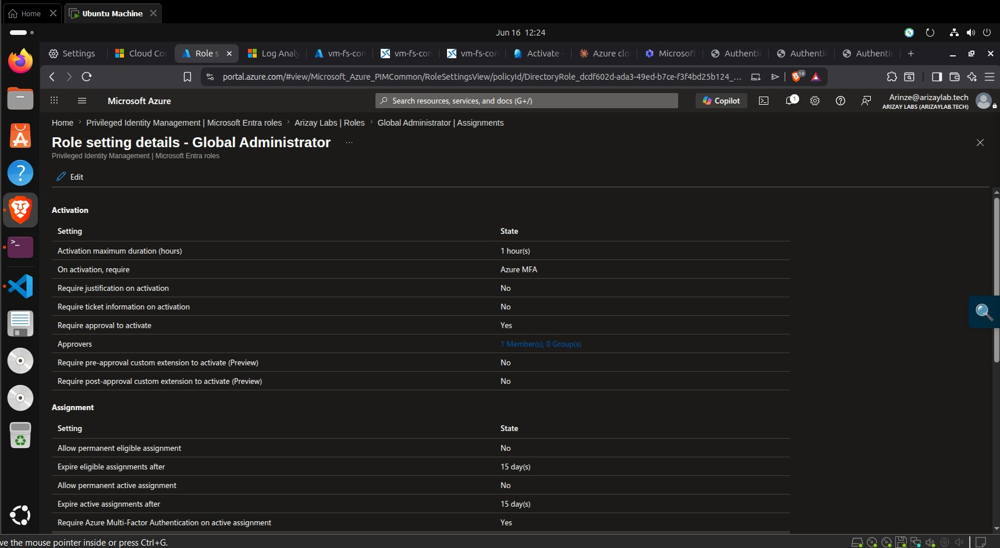
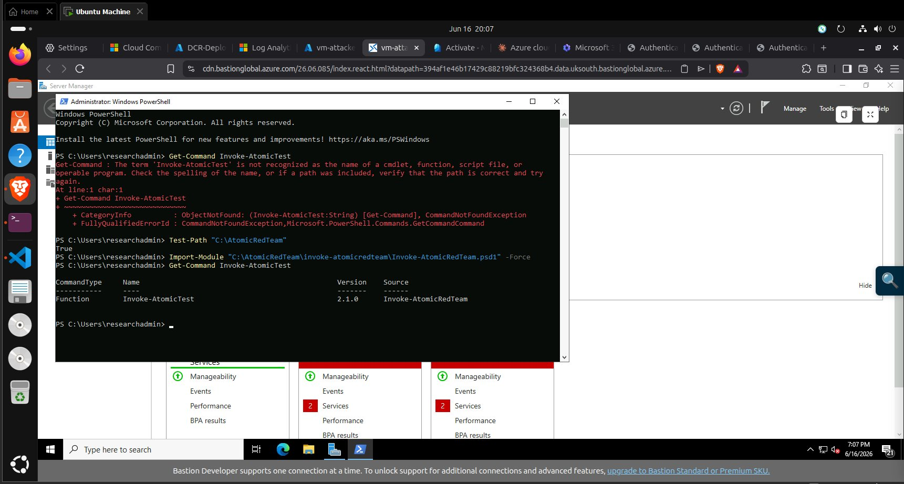
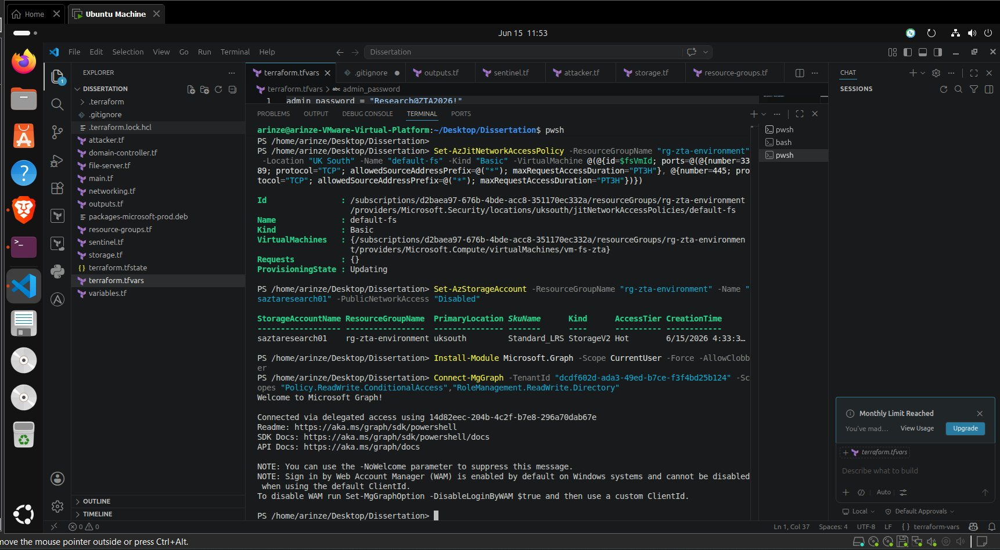

# ZTA Security Controls

[]()
[]()
[]()

---

## What This Folder Does

Applies the complete Zero Trust Architecture control stack exclusively to the ZTA environment (`rg-zta-environment`). The conventional environment receives none of these controls — it remains at Azure defaults, representing the perimeter-security baseline this research evaluates against.

---

## Key Evidence

| Screenshot | Control Confirmed |
|---|---|
|  | NSG `nsg-zta` — 9 rules including `block-attacker-to-fs` Deny port 445 priority 220 |
|  | JIT access active on `vm-dc-zta` and `vm-fs-zta` — ports locked by default |
|  | `saztaresearch01` — Public network access: **Disabled** |
|  | 6 Sentinel analytics rules — all `Enabled: True` |
|  | Conditional Access — Require MFA + Block Legacy Auth both **Enabled** |
|  | PIM — 1hr max activation, approval required, MFA on activation |
|  | Defender for Cloud — Standard tier on VMs and Storage |

---

## Controls Applied and Why

| Control | Azure Implementation | ZTA Tenet (Rose et al., 2020) | Attack Category Blocked |
|---|---|---|---|
| NSG Micro-Segmentation | `block-attacker-to-fs` deny rule (priority 220) | "All communication secured regardless of network location" | Lateral Movement, Data Exfiltration |
| Just-In-Time VM Access | Ports 3389/445 locked — 3hr time-boxed approval | "Access granted on a per-session basis" | Privilege Escalation |
| Defender for Cloud Standard | Standard tier on VMs and Storage | "Monitor and measure integrity of all assets" | All — enhanced detection |
| Storage Private Endpoint | `PublicNetworkAccess: Disabled` | "Secure all resources regardless of location" | Misconfiguration Exploitation |
| Conditional Access MFA | Require MFA for all users and all apps | "Authentication is dynamic and strictly enforced" | Credential Theft |
| Block Legacy Authentication | Block exchangeActiveSync and other protocols | "Authentication is dynamic and strictly enforced" | Credential Theft |
| Privileged Identity Management | 1hr max, approval, MFA on activation | "Grant least privilege access" | Privilege Escalation |
| Sentinel Analytics Rules | 5 scheduled rules on Event table | "Collect info to improve security posture" | All — detection layer |

---

## Prerequisites

```
✅ Azure subscription with ZTA resources deployed (terraform/ completed)
✅ Microsoft Entra ID P2 licence (30-day free trial is sufficient)
✅ Az PowerShell module installed
✅ Microsoft.Graph PowerShell module installed
✅ Global Administrator role on the tenant
```

---

## Application Order

Apply in this order — identity controls require Security Defaults to be disabled first:

```
1. Defender for Cloud (Az module — no licence required)
2. Just-In-Time VM access (Az module — Defender Standard required)
3. Storage lockdown (Az module)
4. Sentinel analytics rules (Az.SecurityInsights module)
5. Disable Security Defaults (Graph module — prerequisite for CA)
6. Conditional Access policies (Graph module — P2 required)
7. Privileged Identity Management (Graph module — P2 required)
8. Verify all controls active before starting attack simulation
```

Full commands for each step in [`security.md`](security.md).

---

## Verify Controls Are Active

Run this before starting attack simulation:

```powershell
# Defender — both should show Standard
Get-AzSecurityPricing | Where-Object { $_.PricingTier -eq "Standard" } |
  Select-Object Name, PricingTier

# JIT — should show ProvisioningState: Succeeded
Get-AzJitNetworkAccessPolicy -ResourceGroupName "rg-zta-environment" |
  Select-Object Name, ProvisioningState

# Storage — should show Disabled
Get-AzStorageAccount -ResourceGroupName "rg-zta-environment" `
  -Name "saztaresearch01" | Select-Object StorageAccountName, PublicNetworkAccess

# Sentinel rules — all should show Enabled: True
Get-AzSentinelAlertRule -ResourceGroupName "rg-zta-environment" `
  -WorkspaceName "law-zta-sentinel" |
  Where-Object { $_.DisplayName -like "ZTA -*" } |
  Select-Object DisplayName, Enabled

# Conditional Access — both should show State: enabled
Get-MgIdentityConditionalAccessPolicy | Select-Object DisplayName, State
```

---

## Why It Was Done This Way

Each control maps directly to one of Rose et al.'s (2020) seven ZTA tenets. The control stack was designed to create layered defence — if one control is bypassed, the next layer intercepts. The empirical results confirm this: NSG blocked at the network layer (attacks never reached authentication), storage private endpoint blocked at the infrastructure layer (no authentication challenge even issued), and JIT contributed to privilege escalation blocking alongside the NSG.

---

## Challenges Faced

**Security Defaults conflict:** Disabling Security Defaults is a prerequisite for creating Conditional Access policies but briefly reduces tenant security. The transition was kept to a single session — disable, create policies, verify active — all within 10 minutes.

**P2 licence timing:** Initial CA policy creation failed with a licensing error. A P2 trial had to be activated at `admin.microsoft.com` mid-session before retrying. Added approximately 20 minutes to setup.

**Sentinel rule table mismatch:** All five initial analytics rules targeted `SecurityEvent` table and returned zero results. Azure Monitor Agent v1.22 routes Windows Security Events to `Event` table, not `SecurityEvent`. All rules were updated. See `../data-analysis/README.md` for the full explanation.

---

## Post-Experiment Cleanup

After data collection is complete, revert all controls:

```powershell
# Disable CA policies
Get-MgIdentityConditionalAccessPolicy | ForEach-Object {
  Update-MgIdentityConditionalAccessPolicy `
    -ConditionalAccessPolicyId $_.Id -State "disabled"
}

# Re-enable Security Defaults
Update-MgPolicyIdentitySecurityDefaultEnforcementPolicy `
  -BodyParameter @{ IsEnabled = $true }

# Downgrade Defender
Set-AzSecurityPricing -Name "VirtualMachines" -PricingTier "Free"
Set-AzSecurityPricing -Name "StorageAccounts"  -PricingTier "Free"
```
